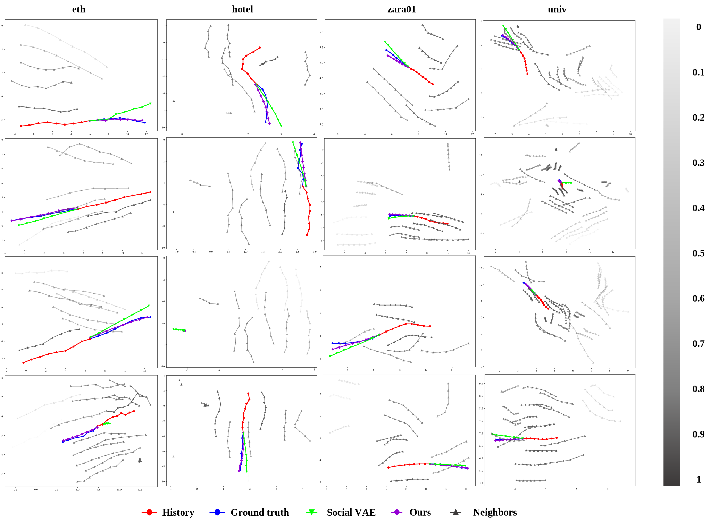
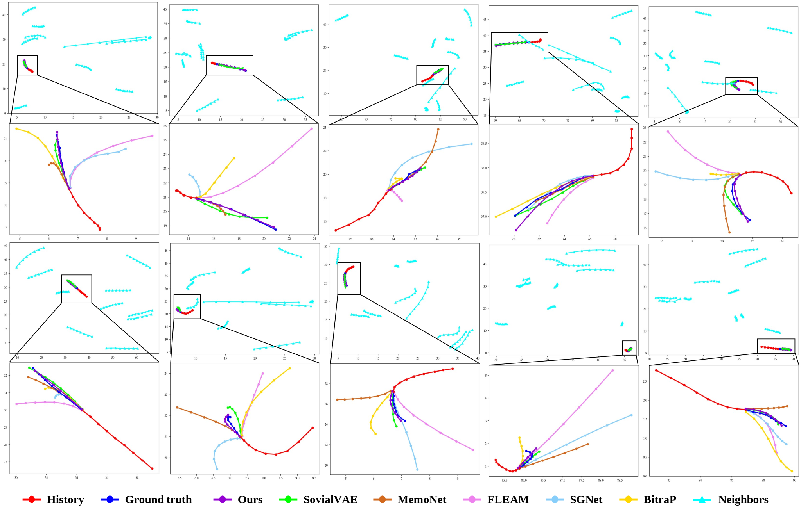
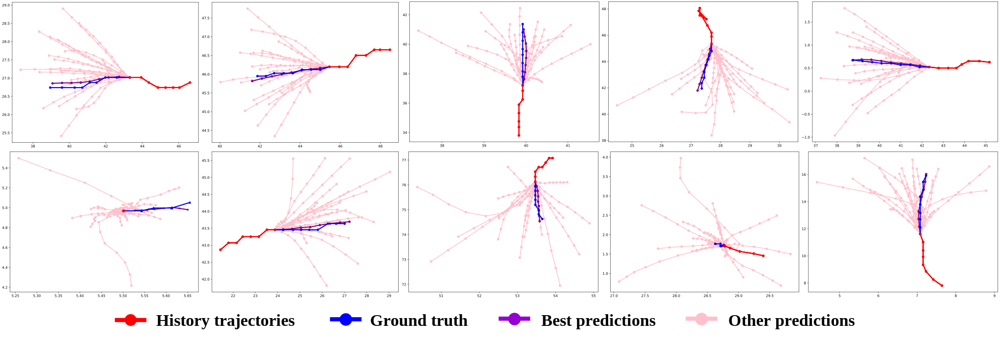

# A Squeeze-Theorem-Based Encoder-Decoder Architecture with a Parallel Prediction Optimizer for Efficient Pedestrian Trajectory Prediction

_**Abstract**_ -- Pedestrian trajectory prediction plays a critical role in enabling smart cities and autonomous driving. However, existing approaches face several limitations: (a) uncertainty regarding the number of neighbors in a scene, (b) divergence and uncertainty during the encoding-decoding process, (c) trajectory prediction collapse caused by overfitting, and (d) inefficiencies in macroscopic processing. To address these challenges, we propose a method that models the motion states of the target agents and their neighbors separately based on motion state decomposition. By leveraging the squeeze theorem from mathematics, we design an encoder comprising a historical inference sub-encoder and a future approximation sub-encoder to approximate the distributions of latent variables. The historical inference sub-encoder incorporates second-order query attention, enabling the efficient and accurate extraction of social intentions. And we design a recurrent conditional variational auto-decoder, which decodes the latent variables to generate trajectories for specified time steps. To mitigate overfitting, latent variables are iteratively updated while being fused with the generated trajectories. Finally, we develop a parallel prediction optimizer which consolidates the temporal dimensions of the generated trajectories, facilitating a macroscopic assessment of trajectory information and ensuring rapid convergence to the desired predictions. Experimental results demonstrate that the proposed method achieves state-of-the-art performance.

_**Visualisation**_--Our approach is tested on the public datasets ETH/UCY, SDD and NBA. In Fig. 6, the neighbors are depicted with gray trajectories, while the attention scores of the agents towards their neighbors are indicated by their transparency; lower transparency signifies higher attention scores and higher transparency indicates lower attention scores. The examples highlight key differences in model performance across various scenarios.

As shown in Fig. 2, results of trajectory prediction for the NBA dataset. The first two rows show the prediction results under the rebound subdataset, and the last two rows show the prediction results under the scores subdataset. We also compare the results with existing better methods when zooming in on the local regions. 

In Fig. 3.  the trajectories predicted by the proposed method are represented in pink, with the result closest to the true trajectory (in blue) designated in purple. It is evident that the proposed model not only delivers accurate predictions but also ensures that the remaining 19 predicted results align with the diversity of agent motion.

## Environment
- Ubuntu 18.04
- Python 3.7.4
- cudnn 8.0.5
- Pytorch 1.11 + cu111
- Numpy 1.21

We recommend to install all the requirements through Conda by

    $ conda create --name <env> --file requirements.txt -c pytorch -c conda-forge

## Code Usage

Command to train a model from scratch:

    $ python main.py --train <train_data_dir> --test <test_data_dir> --ckpt <checkpoint_dir> --config <config_file>

Training and testing data are provided in `data` folder and the configuration files are in `config` folder. 
You can run them to see the results.

    # ETH/UCY
    $ python main.py --train data/eth/train --test data/eth/test --ckpt log_eth --config config/eth.py
    $ python main.py --train data/hotel/train --test data/hotel/test --ckpt log_hotel --config config/hotel.py
    $ python main.py --train data/univ/train --test data/univ/test --ckpt log_univ --config config/univ.py
    $ python main.py --train data/zara01/train --test data/zara01/test --ckpt log_zara01 --config config/zara01.py
    $ python main.py --train data/zara02/train --test data/zara02/test --ckpt log_zara02 --config config/zara02.py

    # SDD
    $ python main.py --train data/sdd/train --test data/sdd/test --ckpt log_sdd --config config/sdd.py

    # NBA
    $ python main.py --train data/nba/rebound/train --test data/nba/rebound/test --ckpt log_rebound --config config/rebound.py
    $ python main.py --train data/nba/score/train --test data/nba/score/test --ckpt log_score --config config/score.py

## Pre-trained Models and Evaluation
Download pre-trained models from: https://pan.baidu.com/s/1koHmnEhLY-dw_VAoi2QJ4Q. code: wa2c.
Put them in the main directory and change the code in socialtrans_test.py that corresponds to the loading model section

    # ETH/UCY
    $ python main.py --test data/eth/test --ckpt models/eth --config config/eth.py
    $ python main.py --test data/hotel/test --ckpt models/hotel --config config/hotel.py
    $ python main.py --test data/univ/test --ckpt models/univ --config config/univ.py
    $ python main.py --test data/zara01/test --ckpt models/zara01 --config config/zara01.py
    $ python main.py --test data/zara02/test --ckpt models/zara02 --config config/zara02.py

    # SDD
    $ python main.py --test data/sdd/test --ckpt models/sdd --config config/sdd_pixel.py

    # NBA
    $ python main.py --test data/nba/rebound/test --ckpt models/nba/rebound --config config/nba_rebound.py
    $ python main.py --test data/nba/score/test --ckpt models/nba/score --config config/nba_score.py

 

## Training New Models

### Prepare your own dataset

Our code supports loading trajectories from multiple files, each representing a scene. Simply split your data into training and testing sets, and save each scene as a `txt` file in the corresponding folder.

Each line in the data files should follow this format:

    frame_ID:int  agent_ID:int  pos_x:float  pos_y:float  group:str

- `frame_ID` and `agent_ID` are integers 
- `pos_x` and `pos_y` are float numbers. 
- The `group` field is optional and can be used to identify the agent type/group. This allows the model to be trained to predict the movements of specific groups/types of agents.

### Setup your config file

We provide our config files in `config` folder, which can be used as reference.

### Training

    $ python main.py --train <folder_of_training_data> --test <folder_of_testing_data> --ckpt <checkpoint_folder> --config <config_file>

### Evaluation

    $ python main.py --test <folder_of_testing_data> --ckpt <checkpoint_folder> --config <config_file>